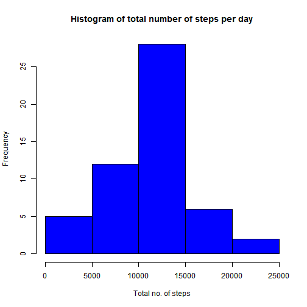
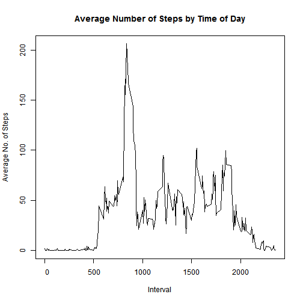
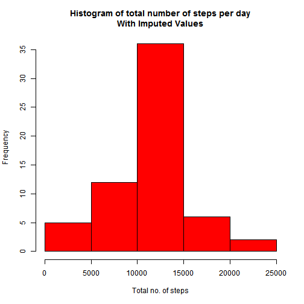

## Loading and preprocessing the data

First of all we loaded the data from "activity.csv", converting the date variable to a date format. We briefly explored the raw data by using the function "describe" from the HMmisc package.  As can be seen there were 61 days worth of data, giving a total of 17,568 5 minute intervals (each day had 288 5 min intervals). 2304 of those 5 minute intervals had  missing data.


```r
## Read in the data

## need to ensure that working directory is set using setwd

data<- read.csv ("activity.csv", header=TRUE)

### convert date to date format

data$date<-as.Date(data$date)

## load Hmisc library so as to use the describe function

library(Hmisc)

describe(data)
```

```
## data 
## 
##  3  Variables      17568  Observations
## ---------------------------------------------------------------------------
## steps 
##       n missing  unique    Info    Mean     .05     .10     .25     .50 
##   15264    2304     617    0.62   37.38     0.0     0.0     0.0     0.0 
##     .75     .90     .95 
##    12.0    86.0   252.8 
## 
## lowest :   0   1   2   3   4, highest: 786 789 794 802 806 
## ---------------------------------------------------------------------------
## date 
##       n missing  unique 
##   17568       0      61 
## 
## lowest : 2012-10-01 2012-10-02 2012-10-03 2012-10-04 2012-10-05
## highest: 2012-11-26 2012-11-27 2012-11-28 2012-11-29 2012-11-30 
## ---------------------------------------------------------------------------
## interval 
##       n missing  unique    Info    Mean     .05     .10     .25     .50 
##   17568       0     288       1    1178   110.0   220.0   588.8  1177.5 
##     .75     .90     .95 
##  1766.2  2135.0  2245.0 
## 
## lowest :    0    5   10   15   20, highest: 2335 2340 2345 2350 2355 
## ---------------------------------------------------------------------------
```

## Mean total number of steps taken per day

Next we prepped the data for the first exercise - the histogram plots and getting the median and mean of the total number of steps taken each day


```r
###
### Getting a data set with  total no of steps for each day 
### ignoring NA's
###

d1<-aggregate(data$steps, by=list(data$date),FUN=sum)

d2<-d1[complete.cases(d1),]

## d1 has the total number of steps per day ignoring NA's and d2 just eliminates
## days that have no step readings
```

The data set d1 has the sum of the number of steps for each day.  The data set d2 has the same data just eliminating the 8 days that had no readings.

Next we plot the histogram of the total number of steps per day, and also calculate the mean and median number of steps.  The **area** of each bar in the histogram represents the frequency (as opposed to a bar chart).


```r
hist (d2$x, main="Histogram of total number of steps per day",xlab="Total no. of steps",col="blue")
```

 

```r
summary(d2$x)
```

```
##    Min. 1st Qu.  Median    Mean 3rd Qu.    Max. 
##      41    8841   10760   10770   13290   21190
```
The median number of steps was **10,760** and the mean number of steps was **10,770** - and as can be seen from both the histomgram and the proximity of the median to he mean, the distribution was relatively symmetric with some left skewness.

##Average Daily Activity Pattern

We want to look at the the average activity i.e. average number of steps across a day during each of the 5 minute intervals.

To do this we want, for each time interval, the average number of steps across all days. As mentioned above there are 288 5 minute intervals in the day, the first from 00:00 to 00:05 (labelled 0) to 23:55 to 24:00 (labelled 2355). We ignored NA's, and also converted the the interval measure to "times" using the *Chron* package.


```r
###
### 
### calculating means by time of day
### convert interval to times
### need the chron package for this
###

library(chron)


avestepsbytime<- aggregate (data$steps,by=list(data$interval), FUN=mean,na.rm=TRUE)
avestepsbytime[,3]<-times(avestepsbytime[,1]) ##converts interval to time


plot (avestepsbytime[,3],avestepsbytime[,2],type="l",main="Average Number of Steps by Time of Day", xlab="Interval",ylab="Average No. of Steps")
```

 

```r
## finding the max number and interval
##sort data by order of ave number of steps
sorteddata<-avestepsbytime[order(avestepsbytime[,2],decreasing=TRUE),]
head(sorteddata,1) #output max at top
```

```
##     Group.1        x  V3
## 104     835 206.1698 835
```
The plot shows the average number of steps by time of day.  On average over the 61 days, the maximum average number of steps was 206.2 in the five minute interval starting at 8:35am.

##Imputing missing values

As mentioned above, and as shown in the initial summary and description of the data, there were **2,304** missing values for the steps variable.

For imputing the missing data we decided the best way to do this was to use the average number of steps in that time interval (as calculated in the section above).  To do this we took the 2304 lines of missing data and replaced the "steps" NA value with the appropriate average at that interval.  We then plotted the hisotgram and calculated the mean and median.


```r
### First let's get the 2304 lines of data with missing steps values
data.NA<- data[!complete.cases(data),]
###Now the data without the missing value lines
data.complete<-data[complete.cases(data),]

### imputing the data
###
### avestepbytime has the average value for each time point
### which we will use to impute data where it is missin
###

x<- -1
data.NA<-data.NA[,x] ### drop interval
names<-c("interval","avesteps")
colnames(avestepsbytime)<- names

## merging the missing data by time interval with average data 
## so where data is missing at any time interval it will be 
## replaced by the averag

mergedata <- merge(data.NA,avestepsbytime,by.x="interval",by.y="interval")

## now rename the data so we can merge it back with the original data

imputed<-mergedata
imputed[,4]<-mergedata$avesteps
imputed[,5]<-mergedata$date
imputed[,6]<-mergedata$interval
y<-c(-1,-2,-3)
imputed<-imputed[,y]
names2<-c("steps","date","interval")
colnames(imputed)<-names2

### Now merge it back with the complete data
### so we now have all the data with imputed values where we had NA's

imputed.data<-rbind(data.complete,imputed)

##sort the data

imputed.data<-imputed.data[order(imputed.data$date,imputed.data$interval),]

### Now we can run the histogram plot as before and calculate
### mean and median

dimp1<-aggregate(imputed.data$steps, by=list(imputed.data$date),FUN=sum)

hist (dimp1$x, main="Histogram of total number of steps per day\nWith Imputed Values",xlab="Total no. of steps",col="red")
```

 

```r
summary(dimp1$x)
```

```
##    Min. 1st Qu.  Median    Mean 3rd Qu.    Max. 
##      41    9819   10770   10770   12810   21190
```

As can be seen the histogram is not disimilar to the one where the missing values were omitted - but of course now with 2,304 more values.  There was no change in the mean which remained at **10,770** steps, but the median was now identical at **10,770** steps - an increase of 10.  Interestingly, the minimum and maximum remained the same (which would be expected given the method of imputing the missing data), but the interquartile range narrowed slightly.  So adding in the imputed average values made the distribution more symmetric and slightly narrower (hence the median becoming equal to the mean).

##Does Activity Differ between Weekdays and Weekends?

Using the data with imputed values, we defined a factor variable with labels "weekday" if the reading was on Monday though Friday, and "weekend" if the reading was taken on a Saturday or Sunday.  There were 12,960 weekday readings - so 45 days worth, and 4,608 weekend readings - equivalent to 16 days.  We then calculated the average number of steps taken at each time interval over the whole time period for the 45 weekdays and for the 16 weekend days.  This was then plotted in a panel plot.


```r
### define day of the week in imputed dataset

imputed.data$weekday<-weekdays(imputed.data$date)

##creating factor variable 

imputed.data$weekend<-rep(0,times=length(imputed.data$weekday))

for (i in 1:length(imputed.data$weekday)) {
              if ((imputed.data$weekday [i] == "Saturday") | (imputed.data$weekday[i] == "Sunday")) imputed.data$weekend[i]<-1
}

imputed.data$weekend <- factor(imputed.data$weekend, levels = c(0,1), labels = c("weekday", "weekend"))

##average no. of steps at each interval for weekend and weekdays

avestepswk<- aggregate (imputed.data$steps,by=list(imputed.data$interval,imputed.data$weekend), FUN=mean,na.rm=TRUE)

## create panel plot using lattice

library(lattice)

xyplot (avestepswk[,3]~avestepswk[,1] | avestepswk[,2],type="l", layout = c(1,2), main="Average Number of Steps by Time of Day\n Comparing Weekdays and Weekends", xlab="Interval",ylab="Average No. of Steps")
```


The figure shows that the activity patterns differ between weekdays and weekends.  In the weekday there is high activity early in the day with a few lower peaks later in the day.  During the weekend the activity started to increase significantly about the same time, and was slightly lower than the weekday maximum, but was more persistent throughout the day - so generally there was more activity at the weekend.
